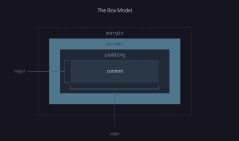
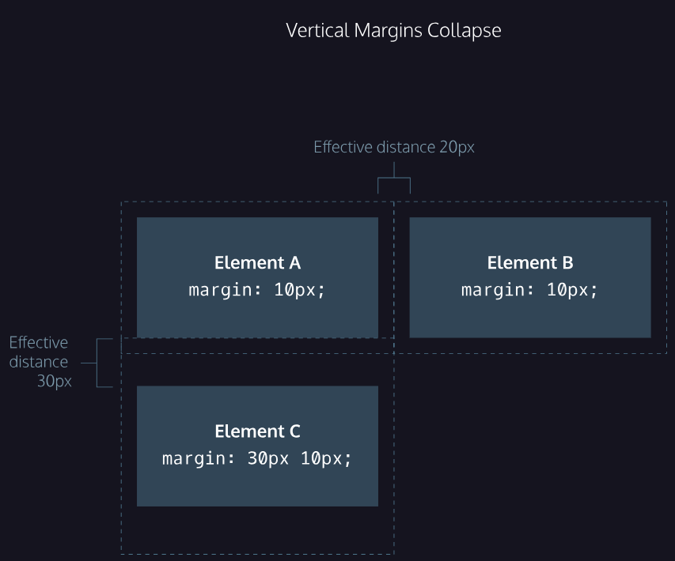

- `margin collapse`
```css
#img-one {
  margin-bottom: 30px;
}

#img-two {
  margin-top: 20px;
}
/*

In this example, the vertical margin between the #img-one and #img-two elements is 30 pixels. Although the sum of the margins is 50 pixels, the margin collapses so the spacing is only dependent on the #img-one bottom margin.

It may be helpful to think of collapsing vertical margins as a short person trying to push a taller person. The tall person has longer arms and can easily push the short person, while the person with short arms cannot reach the person with long arms.

*/

```


---


- `Minimum and Maximum Height and Width`

    - min-width
    - max-width
    - min-height
    - max-height

```css
p {
  min-width: 300px;
  max-width: 600px;
}

/* In the example above, the width of all paragraphs will not shrink below 300 pixels, nor will the width exceed 600 pixels. */

p {
  min-height: 150px;
  max-height: 300px;
}

/* In the example above, the height of all paragraphs will not shrink below 150 pixels and the height will not exceed 300 pixels. */

```

- `Overflow`
    - All of the components of the box model comprise an element’s size. For example, an image that has the following dimensions is 364 pixels wide and 244 pixels tall.

    - 300 pixels wide
    - 200 pixels tall
    - 10 pixels padding on the left and right
    - 10 pixels padding on the top and bottom
    - 2 pixels border on the left and right
    - 2 pixels border on the top and bottom
    - 20 pixels margin on the left and right
    - 10 pixels margin on the top and bottom

    The total dimensions (364px by 244px) are calculated by adding all of the vertical dimensions together and all of the horizontal dimensions together.

 these components result in an element that is larger than the parent’s containing area.

- so how do we view an element that is larger than the parent contianer

- use `overflow property controls` 
    - `hidden`—when set to this value, any content that overflows will be hidden from view.
    - `scroll`—when set to this value, a scrollbar will be added to the element’s box so that the rest of the content can be viewed by scrolling.
    - `visible`—when set to this value, the overflow content will be displayed outside of the containing element. Note, this is the default value.

```css
/* example */
p {
  overflow: scroll; 
}


/* Note:
 set on a parent element to instruct a web browser on how to render child elements. For example, if a div’s overflow property is set to scroll, all children of this div will display overflowing content with a scroll bar.
*/

/* you can have it in the x and y direction */
https://developer.mozilla.org/en-US/docs/Web/CSS/overflow
```