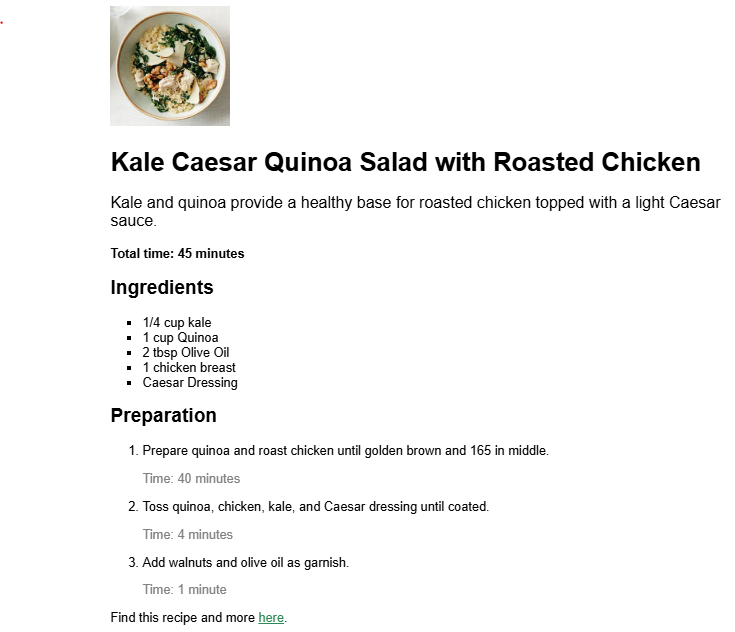
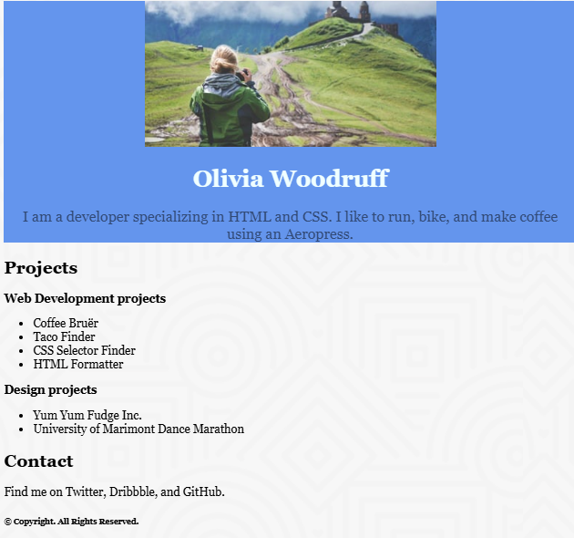
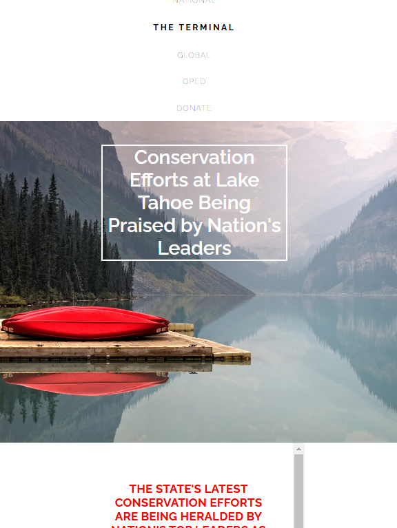

| Abbreviation | Definition |
|-------------|------------|
| 🔑 PC      | Personal Code 🔑 |
| 📚 CC      | Codecademy's Code 📚 |


# Introduction: Fundamentals of CSS

- Documentation [https://developer.mozilla.org/en-US/docs/Web/CSS](https://developer.mozilla.org/en-US/docs/Web/CSS)
- IDs are more specific than classes, and classes are more specific than type. That means IDs will override any styles from a class, and classes will override any styles from a type selector.
  - Project -  PC 🔑 
    - [Top Vacation Spots](./Top_Vacation_Spots/)
- Review Visual Rules

  - font-family, font-size, font-weight, text-align, opacity, !important flag
  - Projects

    1. Blog Site -  PC 🔑 

        

    2. Healthy Recipes Site -  PC 🔑 

        

    3. John Doe Portfolio  -  PC 🔑 
        

- `Box Model`
    - establish a `width` and `height`
    - All elements on a web page are interpreted by the browser as “living” inside of a box. This is what is meant by the box model (dimensions, borders, paddings, margins)
    - Box model - CC 📚 + PC 🔑 
        - 
    - `Pixels` allow you to set the exact size of an element’s box (width and height). When the width and height of an element are set in pixels, it will be the same size on all devices — an element that fills a laptop screen will overflow a mobile screen.
    -  `Border`: can be set with specific 
        - `width` (px, thin, medium, thick), 
        - `style`, (none, dotted, solid, e.t.c.) [check here - 10 different ones](https://developer.mozilla.org/en-US/docs/Web/CSS/border-style#values)
        - `color` [check here, 140 of them and more ](https://developer.mozilla.org/en-US/docs/Web/CSS/color_value)
```css
/* example */
p {
  border: 3px solid coral;
}

/* by default, it is
width-> medium 
style-> none 
color-> color

:where color is the color of the element

for something like this
p {
  border: solid coral;
}
since there is no width, by it will be medium
*/

```

- `border-radius`
    - it modifies the corners of the element's border box

```css
/* example */
div.container {
  border: 3px solid blue;
  border-radius: 5px;
}

/* 
the above example will set all four corners of the border to a radius of 5 pixel
i.e. the same curvature that a circle with a radius of 5 pixels would have
*/

/* Note
You can create a border that is a perfect circle by first creating an element with the same width and height, and then setting the radius equal to half the width of the box, which is 50%.

div.container {
  height: 60px;
  width: 60px;
  border: 3px solid blue;
  border-radius: 50%;
}


*/
```

- `padding`
    - space btn the content of a box and the borders of the box
    - top, right, left, bottom

```css
/*
The code in this example puts 10 pixels of space between the content of the paragraph (the text) and the borders, on all four sides 
*/
p.content-header {
  border: 3px solid coral;
  padding: 10px;
}

/* more flexibility - e.g. specifying only padding at the bottom*/
p.content-header {
  border: 3px solid fuchsia;
  padding-bottom: 10px;
}

p{
 /* top | right | bottom | left */
  padding: 20px 30px 20px 30px;
}


```


- Displayigng and Positioning
